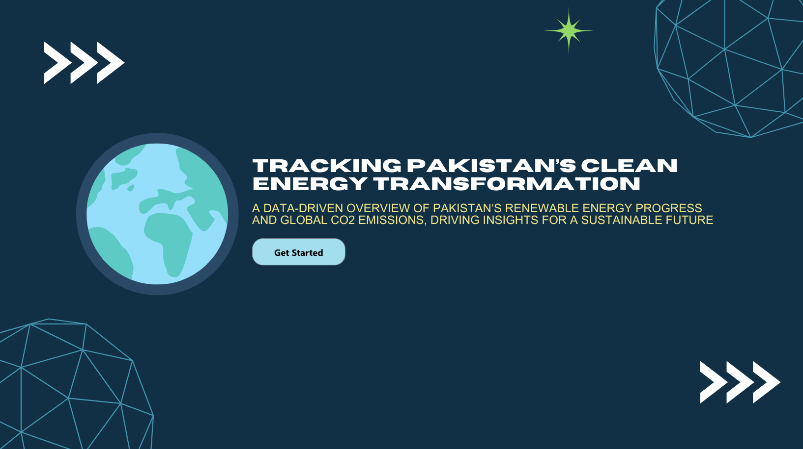
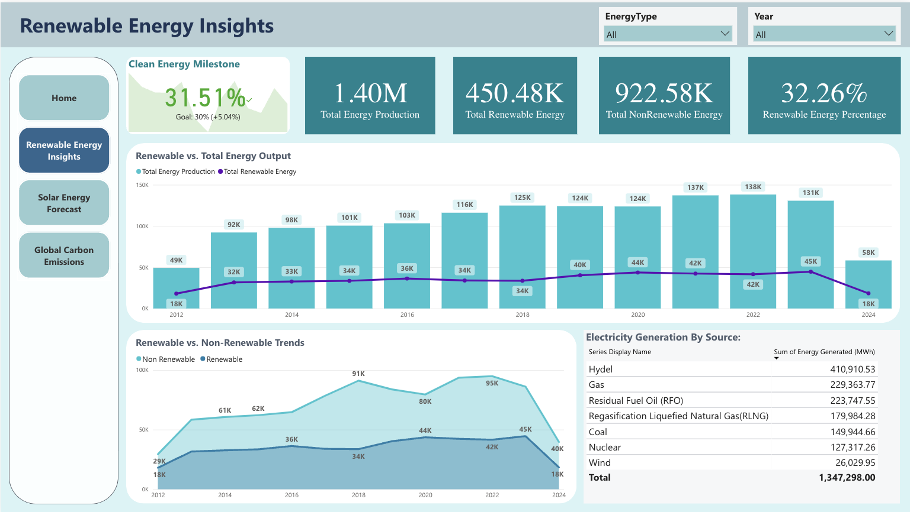
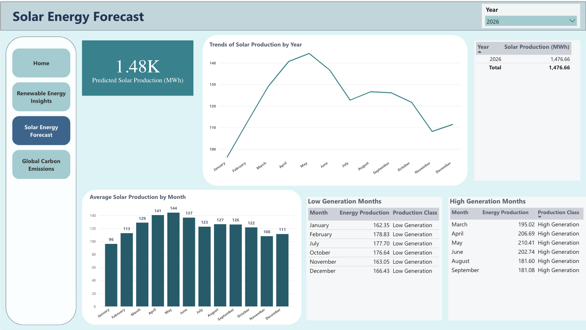
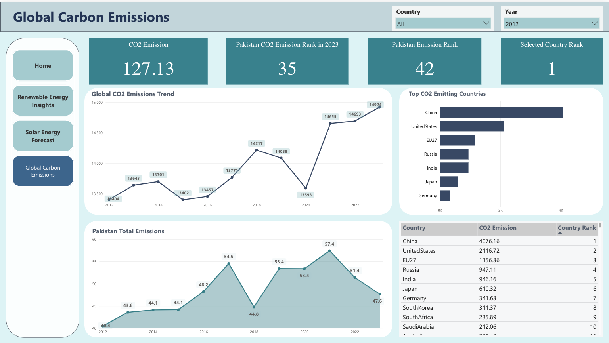

<h1 align="center">Accelerating Pakistan's Clean Energy Transformation</h1>
<h2 align="center">Exploring 12 Years of Power Generation Data</h2>

  <strong>Project by:</strong> Talha Bin Omar, Sami Ullah Abbasi, Ayema Amir

---

<h3>Project Overview</h3>

This project leverages 12 years of historical power generation data from Pakistan (2012-2024) to analyze energy trends, focusing on the country's gradual transition from non-renewable to renewable energy sources. Using this data, we explore key insights into renewable energy adoption, solar power growth, and the impact on CO2 emissions in line with Pakistan's Sustainable Development Goals (SDGs), particularly SDG Goal 7: Clean and Affordable Energy.

The repository includes:
<ul>
  <li>A detailed Power BI dashboard comparing renewable and non-renewable energy sources over the years.</li>
  <li>A SARIMA model used to predict future solar power production based on historical data.</li>
  <li>Datasets sourced from the <em>State Bank of Pakistan</em> and the <em>EDGAR CO2 emissions database</em>.</li>
</ul>

---

<h3>Contents of the Repository</h3>

<ul>
  <li><strong>Power BI Dashboard:</strong> Visualizations comparing renewable and non-renewable energy sources, solar power forecasts, and CO2 emissions.</li>
  <li><strong>SARIMA Model:</strong> SARIMA Model Code and the Trained model along with a script to use this model.</li>
  <li><strong>Energy Production Dataset:</strong> Historical data of energy generation by various sources, downloaded from the <em>State Bank of Pakistan's Data Portal</em>.</li>
  <li><strong>Solar Power Prediction Dataset:</strong> Dataset created using the SARIMA model, which forecasts solar power production for the next 12 months and up to 15 years.</li>
  <li><strong>CO2 Emissions Dataset:</strong> CO2 emissions data from the <em>EDGAR</em> database, which is used to track emissions trends alongside energy transitions.</li>
</ul>

---

<h3>Methodology</h3>

<h4>Data Collection & Cleaning</h4>

We sourced energy production data from the <em>State Bank of Pakistan's Data Portal</em> and CO2 emissions data from the <em>EDGAR</em> database. The data was cleaned and pre-processed to remove inconsistencies, and missing values were handled using forward and backward filling.

<h4>SARIMA Model</h4>

To predict solar power generation, we trained a SARIMA model using historical data from 2012-2023. The model effectively identifies seasonal patterns and forecasts solar energy growth over the next 15 years, with short-term accuracy being its strength. The forecast aligns with Pakistan’s clean energy goals, providing insights into future solar production.

---

<h3>Dashboards</h3>

<ul>
  <li><strong>Starting Page:</strong>
   
     
  </li>
  <li><strong>Dashboard 1: Overview - Renewable vs. Non-Renewable Energy</strong>
     Visualizes the market share and energy production of renewable vs. non-renewable sources from 2012 to 2024, showing the gradual shift towards clean energy. Along with a focus exclusively on renewable sources, breaking down solar, wind, and hydro contributions to Pakistan’s energy landscape.
     
  </li>

  <li><strong>Dashboard 2: Solar Power Predictions</strong>
     Uses the SARIMA model to predict solar power generation for the next 10 to 15 years, highlighting solar’s role in the future of Pakistan’s energy transition.
     
  </li>

  <li><strong>Dashboard 3: CO2 Insights</strong>
     Illustrates how the adoption of renewable energy has impacted CO2 emissions, showing a reduction in emissions as renewable energy use has grown.
     
  </li>

  <li><strong>Dashboard 4: Energy Mix and Trends</strong>
     Shows the historical trends in Pakistan's energy production across all sources, and highlights the increasing contribution of renewable sources.
     
  </li>
</ul>

---

<h3>Key Findings</h3>

<ul>
  <li><strong>Growth of Renewable Energy:</strong> Renewable energy production in Pakistan has grown significantly, from 18,038 GWh in 2015 to 44,586 GWh by 2023, with solar power leading the charge.</li>
  <li><strong>CO2 Reductions:</strong> A 12.67% reduction in CO2 emissions was observed from 2017 to 2023, aligning with the increased adoption of renewable energy sources.</li>
  <li><strong>SARIMA Model Predictions:</strong> Short-term solar power forecasts show a continued rise in production, supporting Pakistan’s commitment to global climate action and the Paris Agreement.</li>
</ul>

---

<h3>Challenges and Limitations</h3>

<ul>
  <li><strong>Data Quality:</strong> The available data had gaps that required significant cleaning and interpolation.</li>
  <li><strong>Infrastructure Issues:</strong> Pakistan’s renewable energy growth faces challenges due to grid capacity and storage limitations.</li>
  <li><strong>SARIMA Model Limitations:</strong> The model works well for short-term predictions, but long-term forecasts depend heavily on past data trends, which may not account for future technological advancements or policy changes.</li>
</ul>

---

<h3>Future Directions</h3>

Our findings support the need for continued investment in renewable energy infrastructure, especially in scaling solar projects. We recommend the following:
<ul>
  <li>Expansion of renewable energy infrastructure, including electric vehicle charging stations.</li>
  <li>Ongoing monitoring of CO2 emissions to track progress in reducing Pakistan’s carbon footprint.</li>
  <li>Encouraging further research and policy development to overcome grid and storage limitations.</li>
</ul>

---

<h3>How to Use the Project</h3>

<ol>
  <li>Clone the repository:
    <pre><code>git clone https://github.com/TBO22/Renewable_vs_Non_Renewable_Datafest_Pakistan.git</code></pre>
  </li>
  
  <li>Open the Power BI dashboard to explore the data insights.</li>
  
  <li>Run the <em>SARIMA</em> model in your Python environment to generate new solar power predictions or analyze the forecast data provided.</li>
  
  <li>Use the datasets to further explore energy production and CO2 emissions in Pakistan.</li>
</ol>

---

<h3>Conclusion</h3>

This project underscores the importance of renewable energy in shaping Pakistan's sustainable future. By analyzing historical trends and forecasting future growth, we aim to contribute to the ongoing dialogue around clean energy, climate action, and national energy security.

<strong>Together, we can build a greener, more sustainable future for Pakistan.</strong>

---

<h3>Contact</h3>

If you have any questions or would like to collaborate, feel free to reach out!

